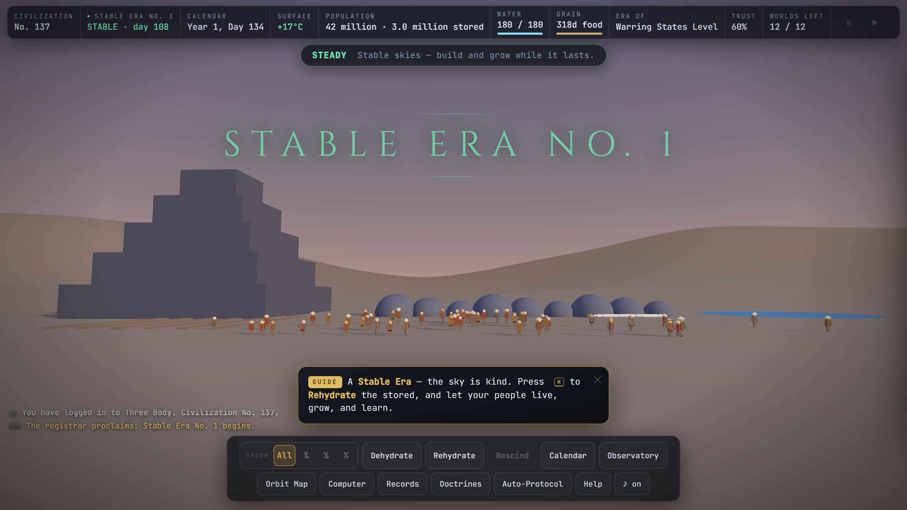
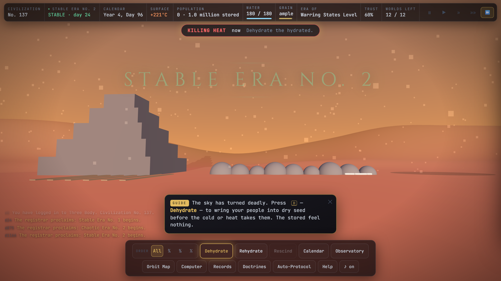
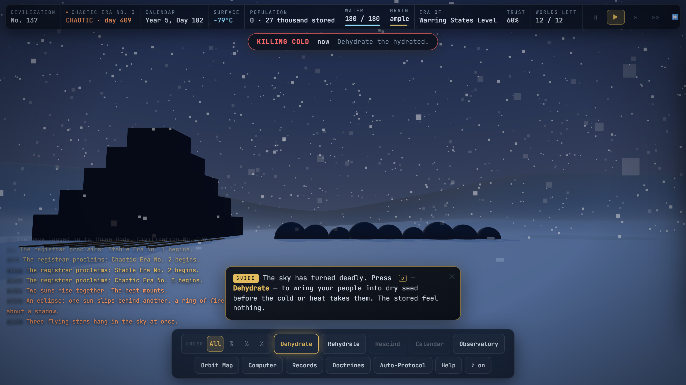
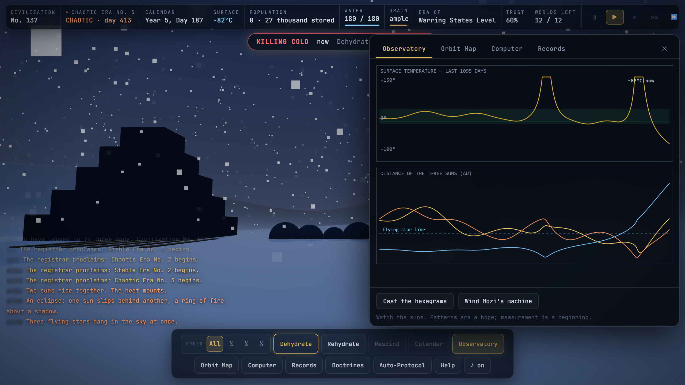

# 三体 — THREE BODY

[](https://github.com/sarthakjain004/three-body-game/actions/workflows/ci.yml)
[](https://sarthakjain004.github.io/three-body-game/)
[](LICENSE)
[](tsconfig.json)

### ▶ Play it now: **[sarthakjain004.github.io/three-body-game](https://sarthakjain004.github.io/three-body-game/)**

> No install, no sign-up, works offline. Desktop browser recommended.

**The game from inside the novel.** In Liu Cixin's *The Three-Body Problem*, players
of a mysterious VR game called «Three Body» wander a world where the sun keeps no
schedule — where civilizations are scorched, frozen, and torn apart in endless
Chaotic Eras, dehydrate to survive, and rise again from their seed, era after era,
until the terrible truth of the three suns is understood.

This is that game, playable. **The physics is real**: three suns evolved as a true
gravitational N-body system (4th-order symplectic integrator, energy drift < 10⁻⁶
per millennium). Nothing about the climate is scripted — Stable Eras, Chaotic Eras,
flying stars, tri-solar days, syzygies and engulfments all *emerge* from the orbits.

## Screenshots

<p align="center">
  <br>
  <em>The Orbit Map — “three suns, one world, no solution.” The planet's chaotic path, traced.</em>
</p>

| Stable Era — the sky is kind | Killing Heat (+221 °C) | Killing Cold (−79 °C) | Read the sky |
|:---:|:---:|:---:|:---:|
|  |  |  |  |

*Every frame is real gameplay — the eras, weather, and disasters emerge from the orbital simulation; nothing is staged.*

## Play

- **Easiest**: open `ThreeBody.html` (single self-contained file, no install, works offline).
- Or open `index.html`, which loads the built bundle `dist/three-body.js`.
- Desktop browser recommended (Chrome/Safari/Firefox/Edge). Sound is optional.
- **Rendering**: full 3D (Three.js, vendored in `lib/`) — shader sky dome, the
  three suns as real directional lights with shadows, an instanced populace
  with duties, and a settlement that physically grows through the ages. If
  WebGL is unavailable the game silently falls back to the built-in 2D
  cinematic renderer (`src/render2d.ts`); the simulation is identical in both.

## How to play

You guide the civilization of Trisolaris, life after life:

| Goal | How |
|---|---|
| Survive | **Dehydrate [D]** before lethal cold/heat; **Rehydrate [R]** when the sky turns kind |
| Manage reserves | Rehydration spends **water** (banked by dehydrating, refilled by lakes in mild weather); the hydrated eat **grain** (harvested only in the growth band, sublinearly — so you can't feed everyone awake). Empty granary → famine. Stockpile in Stable Eras; sleep through Chaotic ones. |
| Keep a workforce | The **All / ¾ / ½ / ⅓** selector sets how much of the populace an order moves — keep a third awake to work the fields and cisterns while the rest sleep safely |
| Choose a doctrine | Each age and each kept Calendar grants **Insight ◆**; spend it [V] on three competing schools — **Calendrical** (predict farther/stake harder), **Dehydratory** (outlast any sky), **Engine** (drive science and the fleet). Doctrines outlive the seed |
| Review | **Records [L]** re-reads the story beats, run stats, adopted doctrines, and the full chronicle |
| Read the sky | Distant suns = *flying stars*. Three at once → deep freeze. 2–3 discs → furnace. Stacked suns → syzygy tides |
| Earn trust | **Proclaim [P]** an era and be right — trust speeds science; failures shatter it |
| Advance | Hydrated people in livable weather do science; each destroyed civilization's seed retains most knowledge |
| Win | Reach the **Space Age** and launch the **Trisolaran Fleet** (1,000 ships) |

Era by era you re-live the book: King Wen's hexagrams, Mozi's celestial machine,
the **Copernicus revelation** (unlocks the true Orbit Map), Qin Shi Huang's
30-million-soldier **human computer** (unlocks ensemble forecasts with an honest
*chaos horizon* — watch sensitive dependence on initial conditions defeat
prediction in real time), Einstein and the pendulum monument, and finally the
announcement that the three-body problem cannot be solved — and the goal changes.

**Keys**: `Space` pause · `1–4` speed (up to 1 year/sec) · `D/R/X` orders ·
`P` proclaim · `O` observatory · `M` orbit map · `C` computer · `A` auto-protocol ·
`H` help. The game autosaves every minute.

The planet has **12 worlds' worth of chances** (the suns of Trisolaris consumed
eleven planets before the novel begins...). Lose them all and the system falls
silent forever.

## Levels, objectives & score

The campaign is a ladder of **levels** — *First Light → The Long Watch → … →
Escape* — each a vetted star system with a clear goal (advance to a given age;
the finale is launching the fleet). Completing one **unlocks** the next. A live
**Objectives** panel always shows the level's goal and the single most useful
next step ("Dehydrate before the killing sky", "Publish a Calendar"), so it's
never a mystery what to do. A running **score** rewards ages reached, population,
calendars kept and survival; each level ends with a **rank (★/★★/★★★)** and your
**best run is saved** to beat. Prefer no rails? **Wild System** is a random
sandbox, scored but outside the ladder.

## The simulation

- Units AU / years / M☉, G = 4π². Suns integrated with adaptive Yoshida-4
  (dt ∝ separation^1.5); the planet is a test particle.
- Star systems are *marginally hierarchical* triples (an eccentric outer sun
  around a close binary, straddling the Mardling–Aarseth stability boundary) —
  long-lived but genuinely chaotic, like a fictionalized Alpha Centauri.
- Surface temperature: blackbody equilibrium from the combined stellar flux with
  thermal inertia. Era classification: the planet must be bound to exactly one
  sun with perturbation < 12% (with hysteresis).
- The Computer's forecast really integrates the system forward — 7 ensemble
  members from perturbed measurements. The "chaos horizon" is wherever they
  disagree by 25 °C. Better instruments (later ages) push it out; nothing
  eliminates it. That is the point — both of the game and of the book.
- "New Game" systems are vetted by a headless bot (`tools/harness.ts`) so they
  are survivable, era-alternating, and winnable. "Wild System" is raw random.

## Build & tooling

Written in **TypeScript** (ES modules), bundled to a single browser script with
**esbuild**; the Node tools run straight from the TypeScript sources via `tsx`.

```bash
npm install            # dev deps: typescript, esbuild, tsx
npm run build          # esbuild → dist/three-body.js + the single-file ThreeBody.html
npm run typecheck      # tsc --noEmit over the whole module graph
npm test               # typecheck + verifiability gates + smoke test (what CI runs)

npm run verify         # six verifiability gates (append :quick for a faster pass)
npm run smoke          # headless full-stack test against a stubbed DOM
npm run bench          # headless throughput benchmark
npm run sweep          # bot-play many seeds, print balance stats
npm run vet            # vet seeds and (re)write src/seeds.ts
npm run screenshots    # capture the README shots from real gameplay (needs Chrome)
```

## Architecture

**TypeScript ES modules**, bundled by esbuild into one browser script (and one
self-contained HTML file); Three.js is the only vendored library and stays a
runtime global. Simulation is fully decoupled from rendering — the exact same
state is drawn by the WebGL renderer, a 2D canvas fallback, or run headless in
Node, which is what lets the entire test suite run without a browser.

```
src/physics.ts    three-sun N-body integrator (adaptive Yoshida-4 symplectic)
src/climate.ts    blackbody surface temperature + Stable/Chaotic era classifier
src/civ.ts        population / water / grain / doctrine economy
src/predict.ts    ensemble forecasting and the emergent "chaos horizon"
src/game.ts       core state machine and simulation loop (headless-safe)
src/story.ts      narrative beats keyed off emergent climate events
src/seeds.ts      star systems vetted by the bot to be survivable & winnable
src/validate.ts   runtime state invariants + determinism fingerprint
src/render2d.ts   2D cinematic renderer   ·   render3d.ts  Three.js renderer (2D fallback)
src/renderer.ts   renderer selection      ·   src/types.ts  shared domain types
src/app.ts        app singleton: state, master loop, save/load   ·   main.ts  entry
src/ui.ts charts.ts portraits.ts audio.ts          presentation layer
tools/            tsx CLIs: build, verify (gates), smoke, bench, harness (bot-play)
```

**Engineering highlights**
- **TypeScript, type-checked in CI** (`tsc --noEmit`) across the whole ES-module
  graph; bundled with esbuild to a single deployable file — no runtime deps.
- A real 4th-order symplectic integrator with adaptive timestep keeps energy
  drift below 10⁻² over a full run — asserted on every CI build.
- Gameplay (eras, weather, disasters) is *emergent* from the orbital dynamics,
  not scripted — and rendering is decoupled, so identical code runs in the
  browser (WebGL or 2D) and headless in Node.
- A self-testing pipeline: `verify.ts` enforces six gates (state invariants,
  energy conservation, determinism, save/load round-trip, story coverage),
  `smoke.mts` drives the full stack against a stubbed DOM, and CI fails if the
  esbuild output drifts from source.
- **Performance** (headless, single thread): the N-body core runs ~290 simulated
  years/sec and the full game step ~60k game-days/sec — ~170× the in-game max
  speed, i.e. well under 1% of one core at top speed (`npm run bench`).

---
*A fan tribute to Liu Cixin's «The Three-Body Problem» (三体). Not affiliated.
All dialogue is paraphrase in homage, not quotation.*
