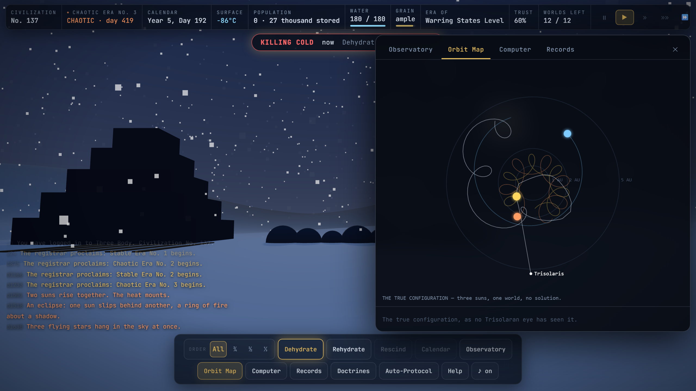

# 三体 — THREE BODY

[](https://github.com/sarthakjain004/three-body-game/actions/workflows/ci.yml)
[](https://sarthakjain004.github.io/three-body-game/)
[](LICENSE)


### ▶ Play it now: **[sarthakjain004.github.io/three-body-game](https://sarthakjain004.github.io/three-body-game/)**

> No install, no sign-up, works offline. Desktop browser recommended.

**The game from inside the novel.** In Liu Cixin's *The Three-Body Problem*, players
of a mysterious VR game called «Three Body» wander a world where the sun keeps no
schedule — where civilizations are scorched, frozen, and torn apart in endless
Chaotic Eras, dehydrate to survive, and rise again from their seed, era after era,
until the terrible truth of the three suns is understood.

This is that game, playable. **The physics is real**: three suns evolved as a true
gravitational N-body system (4th-order symplectic integrator, energy drift < 10⁻⁶
per millennium). Nothing about the climate is scripted — Stable Eras, Chaotic Eras,
flying stars, tri-solar days, syzygies and engulfments all *emerge* from the orbits.

## Screenshots

<!-- Capture real gameplay and drop the files into docs/media/ (see docs/media/README.md). -->



| Chaotic Era → rebirth | Orbit Map & chaos horizon | Stable Era HUD |
|---|---|---|
|  |  |  |

## Play

- **Easiest**: open `ThreeBody.html` (single file, no install, works offline).
- Or open `index.html` (same game, split source files).
- Desktop browser recommended (Chrome/Safari/Firefox/Edge). Sound is optional.
- **Rendering**: full 3D (Three.js, vendored in `lib/`) — shader sky dome, the
  three suns as real directional lights with shadows, an instanced populace
  with duties, and a settlement that physically grows through the ages. If
  WebGL is unavailable the game silently falls back to the built-in 2D
  cinematic renderer (`js/render.js`); the simulation is identical in both.

## How to play

You guide the civilization of Trisolaris, life after life:

| Goal | How |
|---|---|
| Survive | **Dehydrate [D]** before lethal cold/heat; **Rehydrate [R]** when the sky turns kind |
| Manage reserves | Rehydration spends **water** (banked by dehydrating, refilled by lakes in mild weather); the hydrated eat **grain** (harvested only in the growth band, sublinearly — so you can't feed everyone awake). Empty granary → famine. Stockpile in Stable Eras; sleep through Chaotic ones. |
| Keep a workforce | The **All / ¾ / ½ / ⅓** selector sets how much of the populace an order moves — keep a third awake to work the fields and cisterns while the rest sleep safely |
| Choose a doctrine | Each age and each kept Calendar grants **Insight ◆**; spend it [V] on three competing schools — **Calendrical** (predict farther/stake harder), **Dehydratory** (outlast any sky), **Engine** (drive science and the fleet). Doctrines outlive the seed |
| Review | **Records [L]** re-reads the story beats, run stats, adopted doctrines, and the full chronicle |
| Read the sky | Distant suns = *flying stars*. Three at once → deep freeze. 2–3 discs → furnace. Stacked suns → syzygy tides |
| Earn trust | **Proclaim [P]** an era and be right — trust speeds science; failures shatter it |
| Advance | Hydrated people in livable weather do science; each destroyed civilization's seed retains most knowledge |
| Win | Reach the **Space Age** and launch the **Trisolaran Fleet** (1,000 ships) |

Era by era you re-live the book: King Wen's hexagrams, Mozi's celestial machine,
the **Copernicus revelation** (unlocks the true Orbit Map), Qin Shi Huang's
30-million-soldier **human computer** (unlocks ensemble forecasts with an honest
*chaos horizon* — watch sensitive dependence on initial conditions defeat
prediction in real time), Einstein and the pendulum monument, and finally the
announcement that the three-body problem cannot be solved — and the goal changes.

**Keys**: `Space` pause · `1–4` speed (up to 1 year/sec) · `D/R/X` orders ·
`P` proclaim · `O` observatory · `M` orbit map · `C` computer · `A` auto-protocol ·
`H` help. The game autosaves every minute.

The planet has **12 worlds' worth of chances** (the suns of Trisolaris consumed
eleven planets before the novel begins...). Lose them all and the system falls
silent forever.

## The simulation

- Units AU / years / M☉, G = 4π². Suns integrated with adaptive Yoshida-4
  (dt ∝ separation^1.5); the planet is a test particle.
- Star systems are *marginally hierarchical* triples (an eccentric outer sun
  around a close binary, straddling the Mardling–Aarseth stability boundary) —
  long-lived but genuinely chaotic, like a fictionalized Alpha Centauri.
- Surface temperature: blackbody equilibrium from the combined stellar flux with
  thermal inertia. Era classification: the planet must be bound to exactly one
  sun with perturbation < 12% (with hysteresis).
- The Computer's forecast really integrates the system forward — 7 ensemble
  members from perturbed measurements. The "chaos horizon" is wherever they
  disagree by 25 °C. Better instruments (later ages) push it out; nothing
  eliminates it. That is the point — both of the game and of the book.
- "New Game" systems are vetted by a headless bot (`tools/harness.js`) so they
  are survivable, era-alternating, and winnable. "Wild System" is raw random.

## Tools (Node)

```
node tools/harness.js sweep 24 1500     # bot-play many seeds, print balance stats
node tools/harness.js vet 200 1600      # vet seeds and write js/seeds.js
node tools/harness.js seed 2007         # era timeline for one seed
node tools/harness.js energy 1337 1000  # integrator drift check
node tools/smoke.js                     # headless full-stack smoke test
node tools/verify.js [quick]            # verifiability gates: static/data, state
                                        #   invariants, energy drift, determinism,
                                        #   save-load round-trip, story coverage
node tools/bundle.js                    # build single-file ThreeBody.html
```

## Architecture

No framework, no build step, no runtime dependencies — vanilla ES, with Three.js
the only vendored library. The simulation is decoupled from rendering: the exact
same state can be drawn by the WebGL or the 2D renderer, and run headless in Node.

```
js/physics.js     three-sun N-body integrator (adaptive Yoshida-4 symplectic)
js/climate.js     blackbody surface temperature + Stable/Chaotic era classifier
js/civ.js         population / water / grain / doctrine economy
js/predict.js     ensemble forecasting and the emergent "chaos horizon"
js/game.js        core state machine and simulation loop (headless-safe)
js/story.js       narrative beats keyed off emergent climate events
js/seeds.js       star systems vetted by the bot to be survivable & winnable
js/validate.js    runtime state invariants
js/render.js      2D cinematic renderer  ·  render3d.js  Three.js renderer
js/ui.js charts.js portraits.js audio.js main.js   presentation layer
tools/            Node CLI: harness (bot-play), smoke, verify (gates), bundle
```

**Engineering highlights**
- A real 4th-order symplectic integrator with adaptive timestep keeps energy
  drift below 10⁻² over a full run — verified every CI build.
- Gameplay (eras, weather, disasters) is *emergent* from the orbital dynamics,
  not scripted — the same code runs in the browser and headless in Node.
- A self-testing pipeline: `verify.js` enforces six gates (state invariants,
  energy conservation, determinism, save/load round-trip, story coverage),
  `smoke.js` runs the full stack against a stubbed DOM, and CI fails the build
  if the single-file bundle drifts from source.

---
*A fan tribute to Liu Cixin's «The Three-Body Problem» (三体). Not affiliated.
All dialogue is paraphrase in homage, not quotation.*
